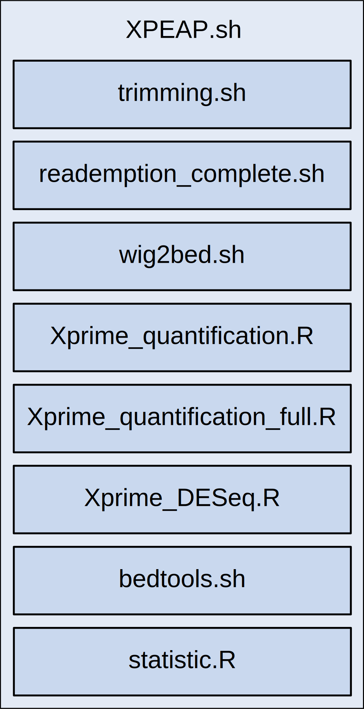
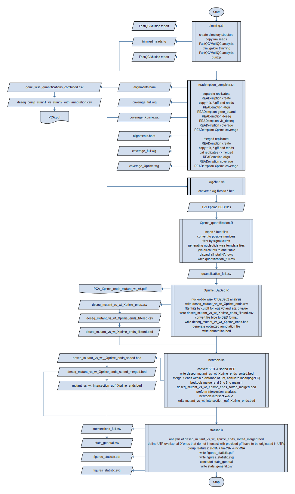

# XPEAP - **X P**rime **E**nd **A**nalysis **P**ipeline

[](https://zenodo.org/badge/latestdoi/253721688)

## About
The XPEAP (**X P**rime **E**nd **A**nalysis **P**ipeline) allows the detection of RNA 5' and 3' ends in prokaryotic NGS data. It is written as an easy to use solution to compare RNA sequencing data from two bacterial strains, each in triplicates, and to identify differential 5'/3' ends. To my knowlege, the basic concept of a 5´ end identification workflow was first published by Förstner et al., 2018 (DOI: 10.26508/lsa.201800080). Based on this method, the aim of this project is to provide a complete pipeline which covers all relevant functions from initial raw data processing to quantification and the final statistical analysis. XPEAP adresses mainly wet lab scientists who are conversant with using UNIX based environments and the command-line interface. The usage is fairly simple and does not require programming. So you are a microbiologist focused on RNA research and you want to compare the presence and abundance of RNA 5'/3' ends in your wildtype and a mutant strain? Great! Just read this documentation, download XPEAP and start your analysis.

### Which input files do I need?

* raw (demultiplexed) RNA read files from NGS
* genomic feature file
* genomic DNA sequence file

### Which functions are provided?
Every step from A to Z is covered:

* quality control of raw  reads (FastQC and MultiQC)
* quality and adapter trimming of raw reads (Trim Galore)
* quality control of trimmed reads (FastQC and MultiQC)
* alignments (READemption)
* coverage of full alignments and X' ends (READemption)
* DESeq2 analysis (READemption)
* DESeq2 based determination of differential X' ends
* intersection of X' ends and annotation file
* statistical analysis, i.e. How many differential X' ends were detected? Do they occur in distinct features? etc.
* visualization of all important results

The READemption pipeline (https://doi.org/10.1093/bioinformatics/btu533) is a core tool, because it is used for the alignments, gene quantification, DESeq2 analysis and the computation of X' end coverage in wig file format. There are more subcommands available than used in XPEAP, so if you want further options, check out the project's website.

### What does the output look like?
XPEAP provides the full RNA sequencing analysis package with a focus on X' end analysis:

* quality control of raw and trimmed reads
* bam alignment files
* coverage files for the full mapping and X' mapping (for the replicate files and also for merged files, which are generated by the pipeline)
* DESeq2 analysis for all annotated features
* X' ends
  * DESeq2 analysis for X' ends
  * principle component analysis and dendrogram
  * BED file with all differential X' ends, called `deseq_mutant_vs_wt_Xprime_ends_sorted_merged.bed` (perfect for visualisation, i.e. with the Integrated Genome Browser)
  * BED file with intersection of X' ends and annotation file, called `mutant_vs_wt_intersection_ggf_Xprime_ends.bed`
  * general statistic file which includes all interesting key figures, called `stats_general.csv`
  * PDF file with various plots, such as distribution of fold changes and enriched features, called `figures_statistic.pdf`. Also avaliable in SVG file format.

### Structure
`XPEAP.sh` includes eight other scripts, which are sequentially executed after having started `XPEAP.sh`.




### Upcoming features
Usage should be as simple as possible and computing time as minimal as possible. This is why in future releases the 5´ and 3´ end detection will both be computed after execution of XPEAP. Will save quite some computing time, especially regarding mapping with segemehl.


## Requirements

This pipeline integrates many commonly used tools and R packages:

* Bioinformatics:
  * FastQC &#8805; v0.11.8 (https://www.bioinformatics.babraham.ac.uk/projects/fastqc/)
  * MultiQC &#8805; v0.9 (https://multiqc.info/)  &#8224;
  * Trim Galore &#8805; v0.6.3 (https://www.bioinformatics.babraham.ac.uk/projects/trim_galore/) &#8224; 
  * READemption &#8805; v0.4.3 (https://doi.org/10.1093/bioinformatics/btu533 , https://reademption.readthedocs.io/en/latest/) &#8224; 
  * Bedops &#8805; v2.4.37 (https://bedops.readthedocs.io/en/latest/) &#8224;
  * BEDtools &#8805; v2.25.0 (https://bedtools.readthedocs.io/en/latest/)

It is *strongly* recommended to install all tools marked with &#8224; in conda environments. Otherwise the pipeline has to be modified manually. 

* R packages:
  * tidyverse &#8805; v1.3.0 (https://github.com/tidyverse/tidyverse)
  * DESeq2 &#8805; v1.26.0 (http://dx.doi.org/10.1186/s13059-014-0550-8 , https://bioconductor.org/packages/release/bioc/html/DESeq2.html)
  * Biostrings&#8805; v2.54.0 (https://bioconductor.org/packages/release/bioc/html/Biostrings.html)
  * gplots &#8805; v3.0.3 (https://cran.r-project.org/web/packages/gplots/index.html)
  * RColorBrewer &#8805; v1.1-2 (https://cran.r-project.org/web/packages/RColorBrewer/index.html)
  
These tools may require individual other software (e.g. READemption uses segemehl as mapper), so please refere to the above mentioned documentations. XPEAP was developed and tested on Ubuntu 20.04 (5.4.0-58-generic) and Ubuntu 16.04.6 LTS (4.15.0-74-generic) with RNA-Seq data from *Rhodobacter sphaeroides* 2.4.1.

## Installation
The XPEAP does not have to be installed since it is composed of several BASH and R scripts. Just copy all XPEAP scripts in your working directory, make them executable using `chmod` and you are good to go.

## Usage
### Editing variables
The usage is super simple: Having finished the previous downloading step, just modify all variables in the header part of `XPEAP.sh` to fit your particular needs. The following variables have to be edited:

* `path_raw_data="/path/to/rawdata"`: path to the folder containing your raw reads (mark the syntax, no final `/`)
* `path_gff="/path/to/annotation_of_my_organism.gff"`: path to the gff you are using
* `path_genomic_fasta="/path/to/genomic_fasta_of_my_organism.fa"`: path to the genomic fasta file your are using

* `strain1="name_of_strain1"`: name of strain1, make sure that strain1 is your mutant/overexpression/... and strain2 your reference strain such as the wildtype strain. This ensures proper labelling during the final analysis.
* `strain2="name_of_strain2"` (see above)

* `strain1_rep1="reads_strain1_biorep1"`: filename of raw read file (mark the syntax, no file type extension!)
* `strain1_rep2="reads_strain1_biorep2"` (see above)
* `strain1_rep3="reads_strain1_biorep3"` (see above)
* `strain2_rep1="reads_strain2_biorep1"` (see above)
* `strain2_rep2="reads_strain2_biorep2"` (see above)
* `strain2_rep3="reads_strain2_biorep3"` (see above)

* `filetype=".fq"`: file type of raw read files, most likely `.fq`
* `compression=".gz"`: compression file type extension of raw reads, most likely `.gz`

* names of your conda environments:
  * `conda_multiqc="name_of_environment_on_my_system"`: MultiQC
  * `conda_trim_galore="name_of_environment_on_my_system"`:Trim Galore
  * `conda_reademption="name_of_environment_on_my_system"`: READemption
  * `conda_bedops="name_of_environment_on_my_system"`: Bedops
* `path_fastqc="/path/to/FastQC"`: path to FastQC bin file 

* READemption variables:
  * `dir="my_READemption_project"`: name for READemption project folders
  * `n_cores="12"`: number of cores to be used for READemption computation
  * `coverage_style="last_base_only"`: Here you can decide, wether you want to analyze the 5' or 3' ends, options are `"first_base_only"` and `"last_base_only"`

The variables for the R analysis are predefined and worked perfectly fine for my data, but you may change them for your own analysis:

* `cutoff_counts="10"`: This variable defines the cutoff for the minimal required read number mapped per X' end and helps to dismiss false positive results. Can be increased by higher sequencing depth.
* `cutoff_padj="0.05"`: cutoff for adjusted *p*-value (Benjamini-Hochberg algorithm, computed using DESeq2), all X' ends with an equal or lower adj. *p*-value are kept for further analysis
* `cutoff_log2FC="1"`: cutoff for minimal required log2 fold change comparing strain1 and strain2 (computed using DESeq2)
* `export cutoff_ratio="0.05"`: minimal required ratio for 3' end coverage / full coverage

Afterwards simply execute `./XPEAP.sh` and enjoy your coffee.

All scripts can be executed individually, just comment the scripts you *do not* want to be executed in `XPEAP.sh`. This ensures that all global variables are passed to the individual script. Great for fine tuning downstream parameters like cutoff values.

### Example for variable header
```BASH
# please modify the content of the following variables:

# path to raw reads
export path_raw_data="/path/to/RNAseq_folder"

# path to gff and genomic.fasta
export path_gff="/path/to/GCF_000012905.2_ASM1290v2_genomic_extended.gff"
export path_genomic_fasta="/path/to/GCF_000012905.2_ASM1290v2_genomic.fa"

export strain1="pnp"
export strain2="wt"

# save filenames of each read file (without file type extension!)
export strain1_rep1="L1802003_Nr25_pnp_exp_1"
export strain1_rep2="L1802004_Nr26_pnp_exp_2"
export strain1_rep3="L1802005_Nr27_pnp_exp_3"
export strain2_rep1="L1802021_Nr43_WT_neu_1"
export strain2_rep2="L1802022_Nr44_WT_neu_2"
export strain2_rep3="L1802023_Nr45_WT_neu_3"
export filetype=".fq"
export compression=".gz"

# path to FastQC bin file
export path_fastqc="/path/to/FastQC"

# names of conda environments
export conda_multiqc="multiqc"
export conda_trim_galore="trimming"
export conda_reademption="rnaseq"
export conda_bedops="bedops"

# READemption settings
# name for READemption project folders
export dir="READemption_pnp_vs_wt"
export n_cores="24" # number of cores to be used for computation

# variables for R analysis
export cutoff_counts="10"
export cutoff_padj="0.05"
export cutoff_log2FC="1"
export cutoff_ratio="0.05"
```

## A more detailed view on the pipeline
For those those of you, who want to dig a bit deeper... here is a simplified flowchart.

